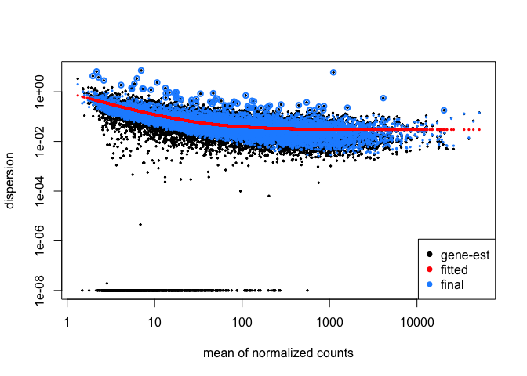
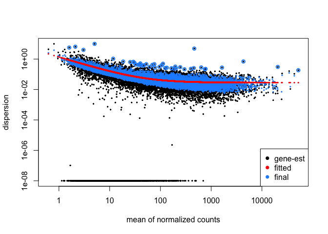
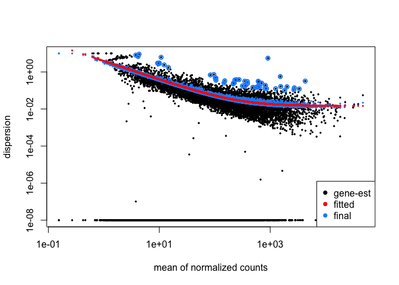
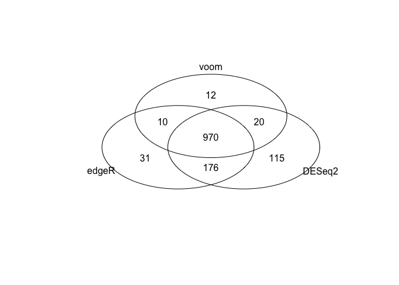

RNA-seq analysis
================

Purpose of this report is to analyze rnaseq data from the bottomly dataset and see how replicates affect the quality of results and compare 3 different methods for reproducibilty of results. The data is availilble at:<http://bowtie-bio.sourceforge.net/recount/>. For more information about why that data was produced see: <https://www.ncbi.nlm.nih.gov/pubmed?term=21455293>.

Variance Between Different Number of Replicates
-----------------------------------------------

``` r
library(DESeq2)
library(edgeR)
library(limma)
library(Biobase)
library(gplots)

load('bottomly_eset.RData')
```

``` r
# Create DESeq2 datasets
dds <- DESeqDataSetFromMatrix(countData = exprs(bottomly.eset), colData = pData(bottomly.eset), design = ~ strain )
dds <- DESeq(dds)

dds.5rep <- DESeqDataSetFromMatrix(countData = exprs(bottomly.5reps), colData = pData(bottomly.5reps), design = ~ strain )
dds.5rep <- DESeq(dds.5rep)

dds.2rep <- DESeqDataSetFromMatrix(countData = exprs(bottomly.2reps), colData = pData(bottomly.2reps), design = ~ strain )
dds.2rep <- DESeq(dds.2rep)
```

DESeq was used to determine the gene estimates and datasets with different number of replicates were comapred, where the smaller datasets, were sampled from the original dataset. Both gene estimation methods, DEseq and EdgeR, use the negative binomial estimation where the dispersion parameter models the variance. When looking at within group variability for genes, the dispersion parameter is used to model the variance between the counts. This dispersion parameter needs to be accurate to determine accurate differential gene expression. One thing to consider is that the dispersion estimate can vary quite significantly for a single gene when there are a small number of replicates.

-   When using DESeq, the dispersion estimate is first calculated by looking at each gene individually by using the maximum liklihood method (black dots)
-   Then a curve is fitted that allows for an accurate estimate of dispersion for a gene based on average expression strength (the red line)
-   The second dispersion estimate uses a bayes approach to shrink the gene-wise dispersion estimates towards values predicted by the fitted curve (blue dots)

If the sample size is large ,then the dispersion shrinkage is not as noticeable as seen in the first plot. When the sample size decreases (2 or 3 samples) as seen in the 3rd plot, the shrinkage increases. Maaning the genes show a higher variance with a small sample size, which can lead to innaccuarate interpretation of differential gene expression.

The method above is described in more detail by the original authors: <https://genomebiology.biomedcentral.com/articles/10.1186/s13059-014-0550-8>

``` r
plotDispEsts(dds) # 10 replicates
```



``` r
plotDispEsts(dds.5rep) # 5 replicates
```



``` r
plotDispEsts(dds.2rep) # 2 replicates
```



Comparing DESeq, EdgeR, and Limma-voom
--------------------------------------

In addition to DESeq, gene expression can also be estimated using EdgeR and Limma-voom.

``` r
##### EdgeR ######                                
dge <- DGEList(counts=exprs(bottomly.eset), group=pData(bottomly.eset)$strain)
# Normalize by total count
dge <- calcNormFactors(dge)  
# Create the contrast matrix
#specifying the samples you want to cmopare to one another
design.mat <- model.matrix(~ 0 + dge$samples$group)

colnames(design.mat) <- levels(dge$samples$group)
# specify group as strain and has 2 categories
# Estimate dispersion parameter for GLM

dge <- estimateGLMCommonDisp(dge, design.mat)
#common dispersion, getting average across genes

dge <- estimateGLMTrendedDisp(dge, design.mat, method="power")
#obtain the trend

dge<- estimateGLMTagwiseDisp(dge,design.mat)
#per gene dispersion
```

``` r
#limma-voom #####
#create design matrix
design <- model.matrix(~ pData(bottomly.eset)$strain)

# Apply voom transformation
nf <- calcNormFactors(bottomly.eset)
v <- voom(exprs(bottomly.eset), design, lib.size=colSums(exprs(bottomly.eset))*nf, 
          normalize.method="quantile", plot=FALSE)
```

The three methods can then be compared to see if they produce similar results.

``` r
#### Differential Gene Expression Comparison ####
p.threshold <- 0.05
## edgeR ##
# Design matrix
design.mat <- model.matrix(~ 0 + dge$samples$group)
colnames(design.mat) <- c("C57BL", "DBA")

# Model fitting
fit.edgeR <- glmFit(dge, design.mat)

# Differential expression
contrasts.edgeR <- makeContrasts(C57BL - DBA, levels=design.mat)
lrt.edgeR <- glmLRT(fit.edgeR, contrast=contrasts.edgeR)

# Access results tables
edgeR_results <- lrt.edgeR$table
sig.edgeR <- decideTestsDGE(lrt.edgeR, adjust.method="BH", p.value = p.threshold)
genes.edgeR <- row.names(edgeR_results)[which(sig.edgeR != 0)]

## DESeq2 ## 
contrast.deseq2 <- list("strainC57BL.6J", "strainDBA.2J")
deseq2_results <- results(dds)
deseq2_results$threshold <- as.logical(deseq2_results$padj < p.threshold)
genes.deseq <- row.names(deseq2_results)[which(deseq2_results$threshold)]


## voom-limma ##
design <- model.matrix(~ pData(bottomly.eset)$strain)

fit.voom <- lmFit(v, design)
fit.voom <- eBayes(fit.voom)

voom_results <- topTable(fit.voom, coef=2,  adjust="BH", number = nrow(exprs(bottomly.eset)))
voom_results$threshold <- as.logical(voom_results$adj.P.Val < p.threshold)
genes.voom <- row.names(voom_results)[which(voom_results$threshold)]

### over lapping genes ###########

length(genes.deseq)
```

    ## [1] 1281

``` r
length(genes.edgeR)
```

    ## [1] 1187

``` r
length(genes.voom)
```

    ## [1] 1012

``` r
venn(list(edgeR = genes.edgeR, DESeq2 = genes.deseq, voom = genes.voom))
```



Even with the dataset containing a large number of replicates, there is still some variablilty between the three methods.
